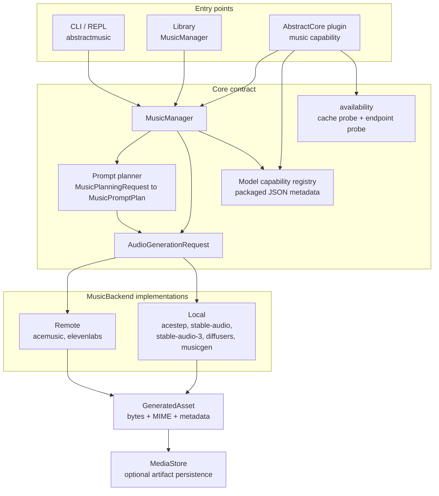
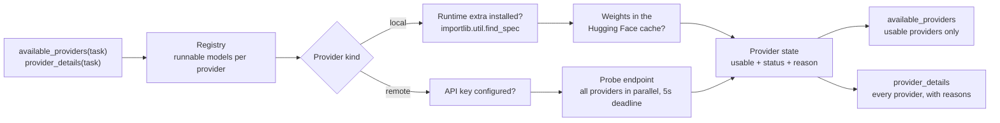

# Architecture

AbstractMusic is organized around a small public contract:

- `MusicManager`: user-facing facade that builds requests and delegates to a backend.
- `MusicBackend`: provider interface for local or remote-compatible generation engines.
- `AudioGenerationRequest`: normalized request object for text-to-music/audio, including optional
  structured composition plans.
- `GeneratedAsset`: binary media result with MIME type and metadata.
- Model capability registry: packaged metadata describing known providers and model constraints.

## Components

Heavy model runtimes load only inside a local backend, on the generation path. Every other box in
this diagram runs on the standard library plus packaged metadata.

## Discovery Flow

Discovery answers "what can this machine run right now" without loading a model.

## Provider Boundary

Provider-specific logic belongs in backends. The public API should not become ACE-Step-specific,
HeartMuLa-specific, or Diffusers-specific. Common concepts such as prompt, lyrics, duration,
format, seed, sample rate, and vocal language can be first-class request fields. Specialized
options should be explicit and documented.

## Text Planning Boundary

Text planning is a separate layer from backend generation. `MusicPlanningRequest` captures the
raw prompt, lyrics, duration, metadata hints, and model/backend context. A planner returns a
`MusicPromptPlan`; `compile_music_prompt_plan(...)` renders that plan into the deterministic
prompt/lyrics/metadata contract required by the selected backend. A planner can also provide a
provider-neutral `MusicCompositionPlan`; compatible backends translate it into their native
structured request shape, and incompatible backends ignore it rather than learning provider-specific
planning logic.

The built-in planner is dependency-free and low-confidence by design. AbstractMusic must not import
AbstractCore or any LLM runtime for planning. Hosts can inject a planner through `MusicManager` or
through AbstractCore plugin config (`music_text_planner`, `music_text_planner_instance`, or
`music_text_planner_factory`). This keeps the intelligence layer swappable while preserving a stable
backend request contract.

When hosted by AbstractCore, the plugin may also use a narrow host text-generation service if the
host supplies one structurally through context/config. AbstractMusic only calls `generate_text(...)`
or `generate_structured(...)`, records planner provenance, and never receives raw AbstractCore
provider/facade objects.

The plugin surface is bidirectional: AbstractCore can also discover AbstractMusic providers,
models, and operations through lightweight `available_providers(...)`, `provider_details(...)`,
`list_models(...)`, `list_operations(...)`, and `capability_catalog(...)` methods.

## Discovery Boundary

Discovery reads packaged model metadata and never loads a generation backend or imports
`torch`, `transformers`, or `diffusers`. Availability comes from `abstractmusic.availability`,
which is standard-library only:

- A local provider is usable when its runtime extra is installed and at least one of its models
  already has weights in the Hugging Face cache. Cache-root resolution mirrors `huggingface_hub`,
  so discovery looks where the loader will look, and presence honours the checked-out revision and
  shard index files.
- A remote provider is usable when an API key is configured and its endpoint answers. Remote
  providers are probed concurrently under a single 5-second deadline, and results are reused for a
  short window so repeated discovery calls do not re-probe.

`available_providers(...)` returns usable providers; `provider_details(...)` returns every known
provider with a `usable` flag and the reason it is not, so an empty list is always explainable.

## Dependency Boundary

Heavy runtime stacks must be imported lazily. The base package stays focused on contracts, manager
code, artifact helpers, docs, CLI/plugin shells, provider metadata, and stdlib-only remote clients.
The base default is `acemusic`, which calls a configured hosted ACE Music-compatible API and does
not install local ML libraries. The second remote client is `elevenlabs`, which is scoped to
ElevenLabs Music endpoints only. Local model engines live behind explicit extras such as `acestep`,
`stable-audio-3`, `diffusers`, `apple`, `gpu`, `all-apple`, and `all-gpu`.
The `acestep` extra installs the supported local ACE-Step provider.
The `stable-audio-3` extra installs only the top-level libraries needed by the internal Small Music
text-to-music path and intentionally excludes upstream Stable Audio runtime packages, UI, training,
LoRA, Flash-Attn, and audio codec libraries.

## Precision Policy

When official 8-bit model artifacts exist, prefer them for local providers. If no official 8-bit
artifact exists, prefer the smallest official 16-bit path before larger precision formats. Do not
invent unofficial quantized checkpoints as defaults.

On Apple hardware, prefer PyTorch MPS for standalone providers when supported. For local ACE-Step,
the `acestep` backend has an explicit CPU float32 fallback when MPS returns non-finite audio.
